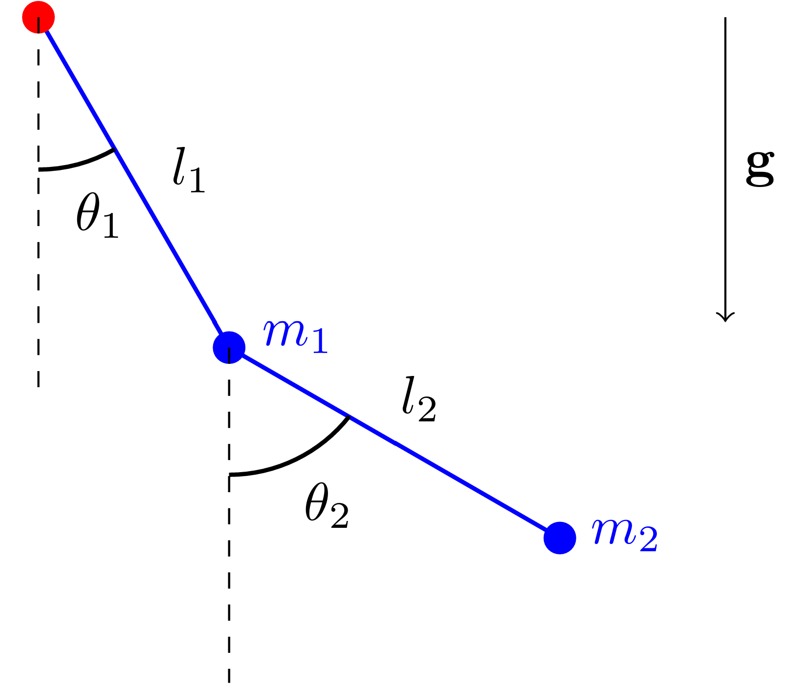
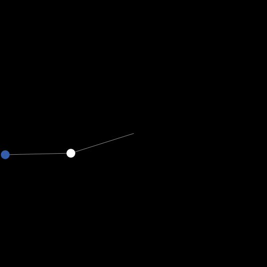
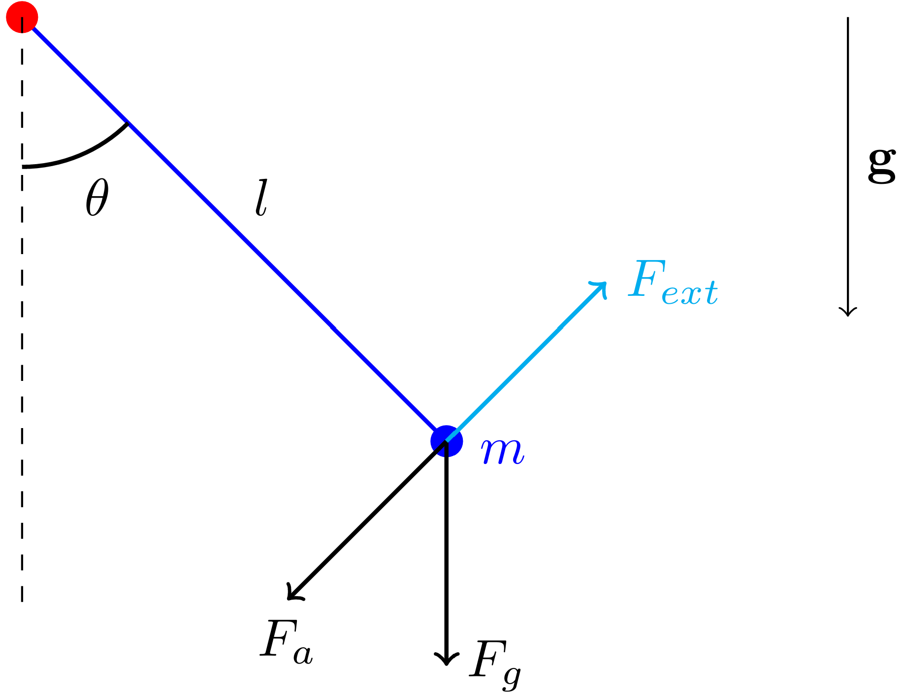
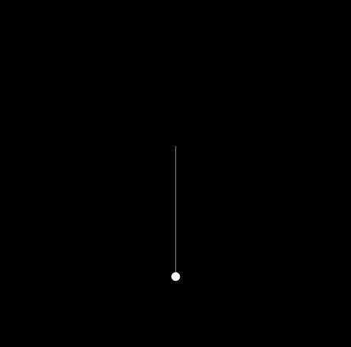
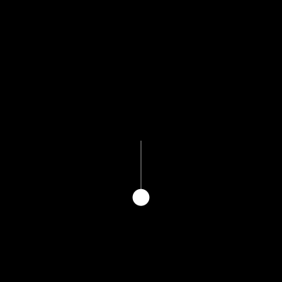

# NetLogo Models of Pendulum
NetLogo simulations of different physical pendulums.

| Pendulum               | Equation of motion    | Simulation            |
|------------------------|-----------------------|-----------------------|
| Double Pendulum    | $$\begin{cases} \ddot{\theta}_1 = \frac{-g(2m_1 + m_2)\sin(\theta_1) - m_2g\sin(\theta_1 - 2\theta_2) - 2\sin(\theta_1-\theta_2)m_2(\dot{\theta}_2^2 l_2 + \dot{\theta}_1^2 l_1\cos(\theta_1 - \theta_2))}{l_1(2m_1+m_2-m_2\cos(2\theta_1-2\theta_2))} \\
    \ddot{\theta}_2 = \frac{2\sin(\theta_1-\theta_2)(\dot{\theta}_1^2 l_1 (m_1 + m_2) + g(m_1 + m_2)\cos(\theta_1) + \dot{\theta}_2^2 l_2 m_2\cos(\theta_1-\theta_2))}{l_2(2m_1+m_2-m_2\cos(2\theta_1-2\theta_2))} \end{cases}$$ |  |
| Driven Pendulum    | $$\ddot{\theta} + \omega^2\theta = \frac{A}{ml}\cos(\Omega t)$$ |  |
| Damped Driven Pendulum    | $$\ddot{\theta} = - \frac{g}{l}\sin\theta + \frac{-\gamma \dot{\theta} + A\cos(\Omega t)}{ml^2}$$ |  |
