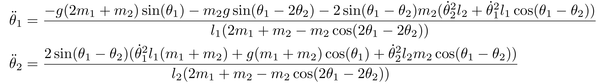

# NetLogo Models of Pendulum
NetLogo simulations of different physical pendulums.

| Pendulum               | Equation of motion    | Simulation            |
|------------------------|-----------------------|-----------------------|
| Double Pendulum    |  |  |
| Driven Pendulum    |  |  |
| Damped Driven Pendulum    |  |  |
